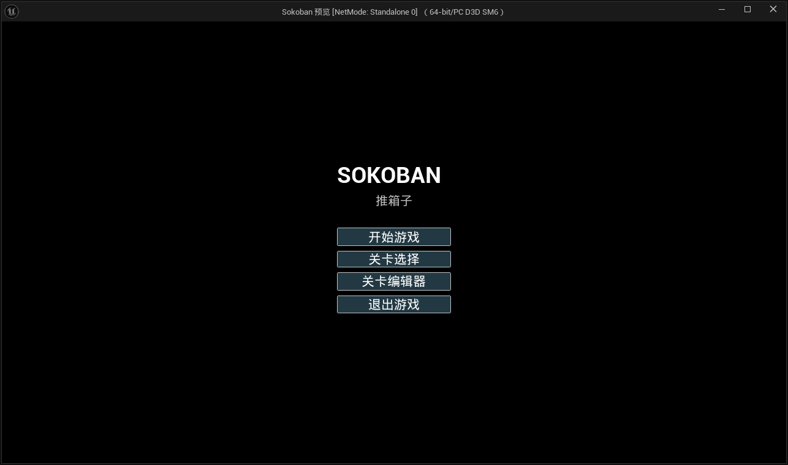
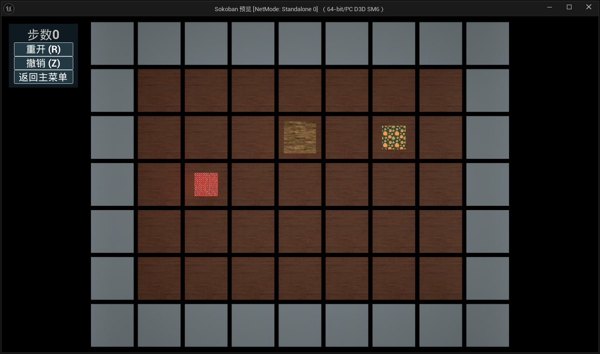
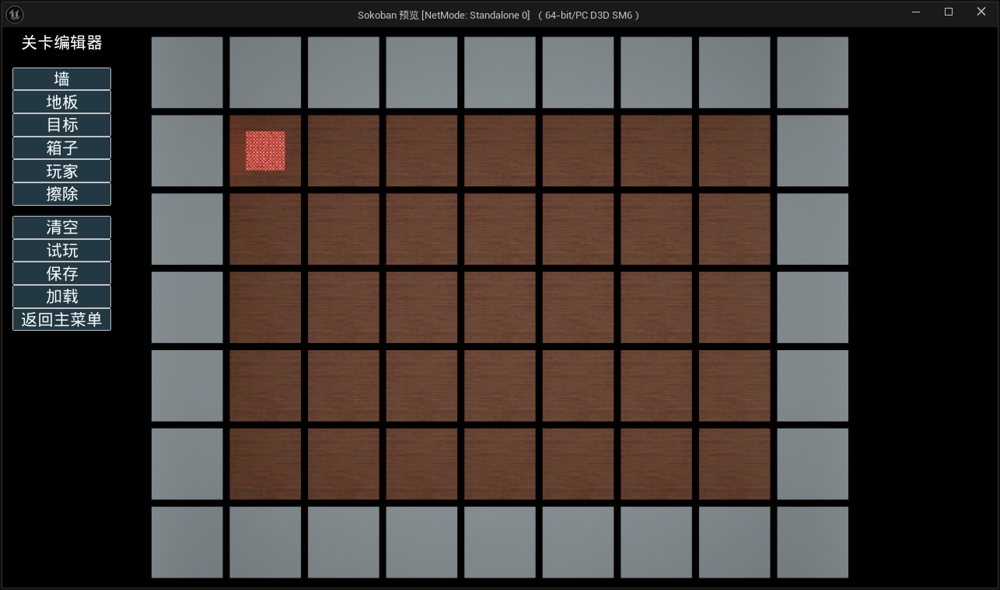

# Sokoban

基于 Unreal Engine 5.5.4 制作的推箱子小游戏，包含完整的游戏流程和运行时关卡编辑器。

## 项目截图

### 主菜单

### 游戏关卡

### 关卡编辑器

## 功能

- 主菜单、关卡选择、三张可玩关卡
- 玩家移动、推箱、步数统计、撤销和重新开始
- 箱子全部到达目标后的通关界面，可重玩、进入下一关或返回主菜单
- 运行时关卡编辑器：绘制墙、地板、目标、箱子和玩家
- 编辑器支持清空、合法性检查、试玩、结束试玩、保存和加载自定义关卡
- 编辑状态下禁用游戏移动输入，试玩状态下恢复游戏输入

## 运行

1. 使用 Unreal Engine 5.5.4 打开 `Sokoban.uproject`。
2. 编译项目并运行编辑器。
3. 从主菜单进入关卡选择，选择关卡开始游戏。
4. 在主菜单进入“关卡编辑器”可创建、验证并保存自定义关卡。

## 操作

| 操作 | 按键 |
| --- | --- |
| 移动 | `W`/`A`/`S`/`D` 或方向键 |
| 撤销 | `Z` |
| 重新开始 | `R` |
| 编辑器绘制 | 鼠标点击棋盘 |

## 目录

- `Source/Sokoban`：游戏玩法、棋盘、玩家和关卡编辑器 C++ 代码
- `Content/Sokoban/Blueprints`：棋盘、玩家和流程蓝图
- `Content/Sokoban/UI`：主菜单、HUD、通关界面和关卡编辑器 UI
- `Content/Sokoban/Maps`：游戏关卡与编辑器地图
- `Config`：项目输入、地图和引擎配置

## 技术说明

棋盘数据由 C++ 统一管理，蓝图负责场景表现和 UI 交互。运行时编辑器通过棋盘坐标修改瓦片数据，并在保存前执行基础合法性检查，避免生成无法继续编辑或试玩的关卡。
